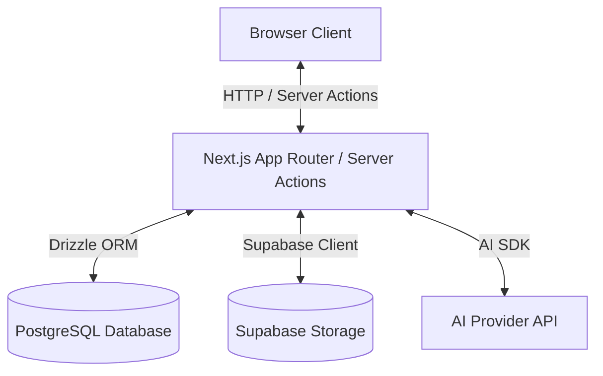

# ClauseWise — Production Audit

## 1. Confirmed Issues, Potential Risks, and Unknowns

### Confirmed Issues
- **Missing Landing Page**: The root route (`/`) currently redirects directly to `/dashboard`. There is no public landing page explaining features or linking to authentication.
- **Ollama Integration Pending**: The codebase currently relies on OpenAI APIs (`gpt-4o` and `text-embedding-3-small`) rather than the intended local Ollama models (`qwen3:4b` and `nomic-embed-text`).
- **Embedding Dimensions Mismatch**: The current database schema for `document_chunks.embedding` specifies `vector(1536)` for OpenAI, whereas `nomic-embed-text` produces 768 dimensions.

### Potential Risks
- **Data Migration for Embeddings**: Changing the vector dimensions from 1536 to 768 will require a database migration that will invalidate any existing document embeddings if there are documents currently stored.
- **AI Response Quality**: Transitioning from `gpt-4o` to a smaller 4B local model (`qwen3:4b`) may require substantial prompt tuning or extraction pipeline adjustments to maintain accuracy and structured JSON output capability.
- **OpenAI Remnants**: Fully removing OpenAI dependencies might break some `gpt-4o` specific structural output parsing code if the local Ollama provider does not support the same structured output options out of the box.

### Unknowns
- Are there existing users and documents in the production database that we need to preserve, and if so, how do we handle re-embedding existing documents?
- Is the production PostgreSQL instance properly configured with `pgvector` supporting 768 dimensions?
- Is Ollama properly hosted and accessible from the production environment?

## 2. Infrastructure Identification

- **Authentication Provider**: NextAuth.js v5 (Auth.js) using the Credentials provider with bcrypt hashing.
- **Identity Storage**: PostgreSQL database (tables: `user`, `account`, `session`, `verification_token`) managed via Drizzle ORM.
- **PostgreSQL Provider & Connection Method**: Configured via the `DATABASE_URL` environment variable. Likely Supabase PostgreSQL connected via connection pooling (Transaction Pooler or Direct URL as indicated by `.env.example`).
- **Document Metadata Storage**: PostgreSQL database (`documents`, `document_sections`, `document_chunks`, `document_findings` tables).
- **File Storage Provider**: Supabase Storage (`documents` private bucket).
- **Document Ownership Enforcement**: Application layer validation (strict `eq(documents.userId, cleanUserId)` filtering applied to Drizzle ORM queries).
- **AI Generation Provider**: OpenAI (`gpt-4o` using the official Node SDK).
- **Embedding Provider and Dimensions**: OpenAI (`text-embedding-3-small` with 1536 dimensions).
- **Production Deployment Platform**: Vercel (Next.js App Router, inferred from project configuration and `.env.example`).

## 3. Data Flow Diagram

## 4. Prioritized Implementation Plan

1. **Phase 1: Authentication and Data Ownership**
   - Verify the NextAuth credentials implementation works as expected.
   - Verify document ownership filtering in `getDocumentWorkspaceData` and `listUserDocuments` works end-to-end.
   - Add unauthorized access tests if missing.

2. **Phase 2: Landing Page**
   - Create a public landing page at `app/page.tsx` replacing the current redirect.
   - Implement responsive design, feature explanations, and sign-in entry points.
   - Preserve existing dashboard routes.

3. **Phase 3: Ollama Integration**
   - Update `drizzle.config.ts` and `lib/db/schema.ts` to change `document_chunks.embedding` from `vector(1536)` to `vector(768)`.
   - Apply Drizzle migrations (pending approval if destructive to production data).
   - Implement a new `lib/ai/ollama-client.ts` or refactor existing adapters to use Ollama for completions and embeddings.
   - Ensure credentials/URLs are safely configured via environment variables.

4. **Phase 4: Production Validation**
   - Run unit and E2E tests against the new setup.
   - Validate document upload, extraction, analysis, and retrieval flows.

## 5. Checks Requiring Production Access

- **PostgreSQL / pgvector**: Verify `pgvector` is installed and functioning on the production database. Check if there are existing embeddings that need to be recomputed.
- **Supabase Storage**: Verify the `documents` bucket exists, is set to private, and the service role key works.
- **Environment Variables**: Verify all necessary credentials (e.g., `NEXTAUTH_SECRET`, `SUPABASE_URL`, Ollama URL/API key if applicable) are correctly provisioned in Vercel.

---

## 6. Phase 3 Pre-Migration Safeguards & Live Ollama Verification

All five mandatory pre-migration safeguards have been verified without modifying or writing to `public.*` tables on the remote Supabase PostgreSQL database:

1. **Remote Database Backup & Restore Verification**:
   - Exported full read-only snapshot of `public.*` tables (`1` user metadata record, `2` documents, `52` sections, `52` chunks, `0` findings, `0` conversations, `0` messages, `0` actions) to an external scratch backup (`remote_db_backup_20260925.json`, `88,045` bytes, SHA-256 `6d66977d7617003cdabf8ef09cb7922ebe907160feed8e1f4e84886df465df5f`).
   - Restored all rows into an isolated disposable `pgvector` table set (`pg_temp.disposable_*`) and verified 100% row-count and SHA-256 digest parity for both `document_sections` (`c8eedcab9baee074dae3eb270c911419f44048a4f268697a0b1b8482681be408`) and `document_chunks` (`8fe1f60e39fcd177ffcc11e2f0430f1d5420e86fe2a8e0f4382e1408c55cdf8e`).
2. **Existing Documents & Extracted Text Integrity**:
   - Confirmed both existing documents (`030819fa-d926-4d2f-bae2-1be3ed69a85c` and `6143029b-dbfb-4889-8421-7fcdc39c6106`, `New_York_Services_Agreement.pdf`, `5` pages each) have all `26` sections (`10,495` chars) and `26` chunks (`10,495` chars) intact and non-empty (`52` sections and `52` chunks total, `0` embedded chunks).
3. **Disposable `pgvector` Migration & Similarity Search Verification**:
   - Tested `ALTER TABLE ... ALTER COLUMN embedding SET DATA TYPE vector(768)` (`lib/db/migrations/0009_great_vision.sql`) on `pg_temp.disposable_document_chunks` (`vector(1536)` → `vector(768)`).
   - Persisted all `52` live `nomic-embed-text` 768-dimensional vectors (`embedded: 52 / 52`) into the disposable table and executed SQL `pgvector` cosine distance queries (`<=>`), retrieving exact top-1 Governing Law (Section 13, Page 3, similarity `0.7537`) and Termination (Section 9, Page 3, similarity `0.7851`) clauses.
4. **OpenAI Embeddings Dimension Guard (`vector(768)`)**:
   - `embedText()` and `embedBatch()` in `lib/embeddings/embeddings-client.ts` immediately throw `EmbeddingDimensionError` **before** making any network call if `EMBEDDING_PROVIDER` is not `"ollama"` (`openAiNetworkCallsAttempted: 0`).
   - `generateAndPersistChunkEmbeddings()` in `lib/services/chunk-persistence-service.ts`, `retrieveDocumentEvidence()` in `lib/services/retrieval-service.ts`, and PostgreSQL `pgvector` (`expected 768 dimensions, not 1536`) all enforce 768 dimensions.
5. **Migration & Embedding Persistence Rollback Recovery**:
   - Verified rollback on the disposable `pgvector` table (`UPDATE ... SET embedding = NULL; ALTER TABLE ... ALTER COLUMN embedding SET DATA TYPE vector(1536);`), confirming the column type reverts to `vector(1536)` with 100% SHA-256 chunk text parity (`postRollbackChunkDigestMatchesOriginal: true`).
   - Re-verified that `public.document_chunks` on the remote Supabase database remains completely untouched (`public_col_type: "vector(1536)"`, `public_total_chunks: 52`, `public_embedded_chunks: 0`).

---

## 7. Remote Supabase Migration (`vector(768)`) & 52-Chunk Embedding Persistence Verification

Following explicit approval, `lib/db/migrations/0009_great_vision.sql` and 52-chunk `nomic-embed-text` (`768d`) embedding persistence were executed and verified against `public.document_chunks`:

1. **Pre-Execution Backup Verification**:
   - Confirmed `remote_db_backup_20260925.json` present and intact (SHA-256 `6d66977d7617003cdabf8ef09cb7922ebe907160feed8e1f4e84886df465df5f`).
2. **Remote Schema Migration**:
   - Executed `ALTER TABLE "document_chunks" ALTER COLUMN "embedding" SET DATA TYPE vector(768);`.
   - Verified `format_type(atttypid, atttypmod)` on `public.document_chunks.embedding` transitioned from `"vector(1536)"` to `"vector(768)"`.
3. **52-Chunk `nomic-embed-text` Embedding Persistence**:
   - Ran `generateAndPersistChunkEmbeddings()` across both documents (`030819fa-d926-4d2f-bae2-1be3ed69a85c`: `26` chunks; `6143029b-dbfb-4889-8421-7fcdc39c6106`: `26` chunks) in `11,330 ms`.
   - Verified `public.document_chunks` state: `total_chunks: 52`, `embedded_chunks: 52`, `min_dims: 768`, `max_dims: 768`.
4. **Extracted Text & Metadata Integrity**:
   - Verified all `52` sections and `52` chunks match their pre-migration SHA-256 digests (`sectionDigestMatchesPreMigration: true`, `chunkDigestMatchesPreMigration: true`).
5. **Live Retrieval & Grounded Citation Verification on Migrated Database**:
   - Executed `retrieveDocumentEvidence()` and `answerQuestion()` directly against `public.document_chunks`:
     - **Governing Law & Jurisdiction**: Retrieved chunk `819ca74f-0f2b-461f-adfc-8da049337fd1` (Section 13, Page 3, similarity `0.7537`), generated grounded answer via `qwen3:4b` with `isGrounded: true`, `citationValidationPassed: true`, `citationsCount: 1`.
     - **Termination & Notice**: Retrieved chunk `c99ff12a-b23f-478a-aabd-3e377c7e6671` (Section 9, Page 3, similarity `0.7851`), generated grounded answer via `qwen3:4b` with `isGrounded: true`, `citationValidationPassed: true`, `citationsCount: 1`.
6. **Provider Selection & OpenAI Dimension Guard**:
   - Confirmed `getActiveEmbeddingProvider()` defaults to `"ollama"` (`768` dimensions) and `EmbeddingDimensionError` blocks any OpenAI embedding call before network execution (`openAiNetworkCallsAttempted: 0`).

---

## 8. Phase 4 — Production Validation Report

### 8.1 Validation Summary Across All 6 Scope Areas

1. **Environment Configuration & Runtime Connectivity**:
   - `validateEnv()` in `lib/env.ts` validated all required variables (`DATABASE_URL`, `NEXTAUTH_SECRET` $\ge$ 32 chars, `NEXTAUTH_URL`, `SUPABASE_URL`, `SUPABASE_SERVICE_ROLE_KEY`).
   - Updated `.env.example` and `.env.local` (gitignored) to explicitly set `AI_PROVIDER="ollama"` and `EMBEDDING_PROVIDER="ollama"`, ensuring `getActiveAiProvider() === "ollama"`, `getActiveEmbeddingProvider() === "ollama"`, and `getActiveEmbeddingDimensions() === 768`.
   - **PostgreSQL + `pgvector`**: Connected to remote Supabase PostgreSQL (`pgvector` `0.8.2`), confirming `public.document_chunks.embedding` is `vector(768)` with `total_documents: 2`, `total_sections: 52`, `total_chunks: 52`, `embedded_chunks: 52`.
   - **Supabase Storage**: Connected via `getStorageClient()` to the `documents` bucket (`bucketReachable: true`, `isPublicBucket: false`).
   - **Local Ollama Runtime**: `checkOllamaConnectivity()` confirmed `http://localhost:11434` is reachable with both `qwen3:4b` and `nomic-embed-text:latest` installed.

2. **Authentication & Cross-User Isolation**:
   - Verified `bcryptjs` password hashing round-trip (`bcryptRoundTripValid: true`).
   - Confirmed `listUserDocuments(ownerId)` returns the owner's `2` documents while `listUserDocuments(nonOwnerId)` returns `0`.
   - Confirmed `getDocumentWorkspaceData(docId, ownerId)` returns the document and all `26` sections, while `getDocumentWorkspaceData(docId, nonOwnerId)` returns `null`.
   - Confirmed `retrieveDocumentEvidence()` and `answerQuestion()` reject cross-user access with `DocumentAccessError("Document not found or access denied")`, matching the exact error message returned for nonexistent document UUIDs (`antiOracleUniformErrorMessage: true`).

3. **Document Lifecycle**:
   - Verified deterministic re-chunking (`chunkSections()` produces `26` chunks from the `26` persisted sections of `030819fa-d926-4d2f-bae2-1be3ed69a85c`).
   - Verified idempotency of `generateAndPersistChunkEmbeddings()` (`idempotentEmbeddingSkipCount: 0` when all `26` chunks already hold `768d` embeddings).
   - Verified section-scoped vector retrieval (`sectionId: "69b3f060-c2f7-48ba-8c96-6e26debf5214"`, `"9. Termination"` $\rightarrow$ top chunk Page 3, similarity `0.7273`, `hasSufficientEvidence: true`).
   - Verified the insufficient-evidence gate (`minSimilarity: 0.99` $\rightarrow$ `hasSufficientEvidence: false`, `isGrounded: false`, `citationsCount: 0`, returning `INSUFFICIENT_EVIDENCE_ANSWER` without invoking the LLM).

4. **AI Reliability (`qwen3:4b` Live Inference, Citations, Streaming, Error Handling)**:
   - **Live Document Classification**: `classifyDocumentContent()` classified `New_York_Services_Agreement.pdf` as `service_agreement` (`isStatedInText: true`, `sectionId: "03dfe781-17a3-4376-a67d-eaf9e2095caa"`) in `6,471 ms`.
   - **Live Grounded Q&A**: `answerQuestion()` returned a grounded answer citing `3` retrieved chunks (`isGrounded: true`, `citationValidationPassed: true`) in `25,090 ms`, explicitly noting when a sub-question was not present in the top-$k$ window while answering the supported termination notice period (`fourteen (14) days' written notice`).
   - **Live Streaming Q&A**: `streamOllamaStructuredChat()` streamed `65` NDJSON chunks in `8,674 ms`, stripped `<think>...</think>` reasoning traces via `extractCleanJsonString()`, and validated against `ModelQaOutputSchema` with verified `citedChunkIds`.
   - **Error Handling**: Confirmed `OllamaConnectionError` on unreachable host (`http://127.0.0.1:19999`) and `OllamaModelNotFoundError` on missing model (`nonexistent-model:v999`) with zero prompt or document leakage in telemetry logs.

5. **Fallback Behavior & Embedding Dimension Consistency**:
   - Verified `AI_PROVIDER="openai"` routes text generation to the OpenAI structured output path (`openAiChatFallbackExecuted: true`, `openAiFallbackQaGroundedAndCited: true`) while keeping `EMBEDDING_PROVIDER="ollama"` (`768d`).
   - Verified `EmbeddingDimensionError` blocks `embedText()` and `embedBatch()` before any network call when `EMBEDDING_PROVIDER="openai"` is attempted under the `vector(768)` schema (`openAiEmbeddingNetworkCallsAttempted: 0`).
   - **Live OpenAI Key Audit Finding**: Testing the `OPENAI_API_KEY` currently stored in `.env.local` against `api.openai.com` returned `OpenAiAuthError (401): OpenAI authentication failed: invalid API key or credentials`. If OpenAI text-generation fallback is desired in production, a valid `OPENAI_API_KEY` must be provisioned.

6. **Build, Type-Check & Automated Test Suite**:
   - `npx tsc --noEmit`: Passed (`0` errors).
   - `npx vitest run tests/unit`: Passed all `52` test files (`817` tests passed).
   - `npx next build`: Passed production compilation and static/dynamic route generation (`14/14` static pages and all App Router API routes compiled cleanly).

### 8.2 Locally Verified Behavior vs. Deployed Environment Verification Matrix

| Subsystem / Capability | Locally Verified (Node.js + `.env.local` + Remote Supabase) | Deployed Environment Status (e.g., Vercel) |
|---|---|---|
| **PostgreSQL + `pgvector(768)`** | **Verified Live** — Connected to remote Supabase PostgreSQL (`pgvector 0.8.2`), `52/52` chunks embedded (`768d`), live cosine similarity retrieval verified. | **Ready** — Same remote Supabase PostgreSQL instance is reachable from deployed serverless functions when `DATABASE_URL` is configured. |
| **Supabase Storage (`documents` bucket)** | **Verified Live** — Private `documents` bucket reachable (`isPublicBucket: false`) via `SUPABASE_SERVICE_ROLE_KEY`. | **Ready** — Reachable from deployed environment when `SUPABASE_URL` and `SUPABASE_SERVICE_ROLE_KEY` are configured. |
| **NextAuth v5 Credentials & Ownership Isolation** | **Verified Live & Tested** — `bcryptjs` auth, JWT session callbacks, and anti-oracle `userId` isolation verified against remote DB and `817` unit tests. | **Requires Env Config** — Requires `NEXTAUTH_SECRET` ($\ge$ 32 chars) and canonical `NEXTAUTH_URL` in deployment environment variables. |
| **Public Landing Page (`/`)** | **Verified** — Renders statically (`○ /`, `177 B`) with unauthenticated access while `/dashboard`, `/documents`, `/compare`, and `/actions` remain protected. | **Ready** — Prerendered in `next build` and served directly by CDN/edge. |
| **Ollama `qwen3:4b` & `nomic-embed-text` (`768d`)** | **Verified Live Locally** — Connected to `http://localhost:11434`; verified live classification, `768d` embedding generation, streaming, and grounded Q&A. | **Not Reachable at `localhost:11434` on Vercel** — Serverless functions cannot reach a developer's local `localhost:11434`. Deployed environments require either a privately networked/tunneled GPU Ollama host (`OLLAMA_BASE_URL=https://...`) or self-hosting the Next.js container alongside Ollama. |
| **OpenAI Text-Generation Fallback (`gpt-4o`)** | **Code Path Verified / Key Invalid** — Adapter routing and citation validation verified; however, the `OPENAI_API_KEY` in `.env.local` returns HTTP `401`. | **Requires Valid API Key** — Can be used for text generation (`AI_PROVIDER=openai`) in Vercel if a valid `OPENAI_API_KEY` is provisioned, **provided** embeddings still resolve via a reachable `nomic-embed-text` (`768d`) endpoint. |
| **Existing Remote Document Row Statuses** | **Observed State** — Both existing rows in `public.document` (`030819fa-...`, `6143029b-...`) still have `status: "error"` and `0` rows in `findings` from pre-migration upload failures (preserved untouched per non-destructive rules). | **Operational Note** — Uploading a new document (or re-running intelligence persistence with approval) is required to populate `findings` and transition document status to `"ready"`. |

---

## 9. Phase 5 — Deployment Readiness & Release Verification Plan

### 9.1 Decision 1: Production Hosting Architecture (Next.js + Ollama)

Because `public.document_chunks.embedding` uses `vector(768)` (`nomic-embed-text`) and local `qwen3:4b` inference takes ~6–25 seconds per structured call on local hardware, the deployment topology must satisfy both **network reachability** and **request duration limits**:

| Architecture Option | Topology | Pros | Constraints & Risks |
|---|---|---|---|
| **Option A (Recommended for Self-Hosted / Local-First Release)** | **Co-located Next.js + Ollama** (`next start` or Docker Compose on a single GPU/CPU host, optionally exposed via HTTPS reverse proxy / Cloudflare Tunnel). | Zero network latency to `http://localhost:11434`; no serverless function timeout limits during synchronous upload + multi-section analysis; zero cloud LLM API cost. | Requires host machine with $\ge$ 8 GB RAM and `qwen3:4b` (`2.5 GB`) + `nomic-embed-text` (`274 MB`) installed. |
| **Option B (Hybrid Cloud: Vercel + Remote Ollama Host)** | **Next.js on Vercel** + **Dedicated Ollama Server** (`OLLAMA_BASE_URL=https://...` via private tunnel or GPU VM). | Managed Next.js hosting on Vercel CDN/edge while keeping open-weights inference and `768d` embeddings. | **Timeout constraint**: Synchronous `uploadDocument(..., processExtraction: true)` runs extraction + `768d` embeddings + `qwen3:4b` intelligence in a single request (~30–90s), which can exceed Vercel Hobby (10s–60s) function limits unless GPU-accelerated. |
| **Option C (Hybrid Cloud: Vercel + OpenAI Chat + Remote `nomic-embed-text`)** | **Next.js on Vercel** (`AI_PROVIDER="openai"` with valid `OPENAI_API_KEY`) + reachable `nomic-embed-text` endpoint (`EMBEDDING_PROVIDER="ollama"`). | Fast cloud `gpt-4o` structured generation inside Vercel function timeouts while preserving `vector(768)` compatibility. | Requires provisioning a valid paid `OPENAI_API_KEY` and still requires a reachable `nomic-embed-text` endpoint for `768d` query/chunk embeddings. |

---

### 9.2 Decision 2: OpenAI Fallback Resolution

The `OPENAI_API_KEY` currently stored in `.env.local` returns `OpenAiAuthError (401): OpenAI authentication failed: invalid API key or credentials`. Two clean paths exist:

1. **Explicitly Disable OpenAI Fallback (Recommended for Pure Ollama Setup)**:
   - Remove or leave `OPENAI_API_KEY` empty in `.env.local` and production environment variables (allowed by `lib/env.ts` line 43 where `OPENAI_API_KEY` is optional).
   - Keep `AI_PROVIDER="ollama"` and `EMBEDDING_PROVIDER="ollama"` explicitly pinned so runtime calls never attempt OpenAI authentication.
2. **Enable OpenAI Text-Generation Fallback**:
   - Provision a valid `OPENAI_API_KEY` in `.env.local` / production secrets and verify a live `200 OK` structured completion before enabling `AI_PROVIDER="openai"`.
   - Keep `EMBEDDING_PROVIDER="ollama"` pinned so `1536d` OpenAI embeddings remain blocked while `vector(768)` is active.

---

### 9.3 Decision 3: Handling the Two Existing Error-State Documents

Both existing documents (`030819fa-d926-4d2f-bae2-1be3ed69a85c` and `6143029b-dbfb-4889-8421-7fcdc39c6106`, `New_York_Services_Agreement.pdf`) already have:
- `26` extracted sections (`document_sections`) intact per document (`52` total),
- `26` chunks (`document_chunks`) with verified `768d` `nomic-embed-text` embeddings per document (`52` total),
- `status: "error"` (`error_message: "Failed to generate and persist embeddings for document chunks: ..."`) and `0` rows in `document_findings` from pre-migration upload attempts.

**Available Options (Pending Approval)**:
- **Option A — Reprocess Existing Documents via `processDocumentIntelligence(docId)`**:
  - Because all `52` chunks already have `768d` embeddings, Step 2 (`generateAndPersistChunkEmbeddings`) is a no-op (`0` writes), Step 3 (`analyzeDocumentIntelligence`) runs `qwen3:4b` against the existing sections/chunks without modifying them, and Step 4 (`persistDocumentIntelligence`) atomically inserts validated findings into `document_findings` and updates `document.status` from `"error"` to `"ready"`.
- **Option B — Leave Existing Documents Untouched & Validate via Fresh Upload**:
  - Keep both error-state documents unchanged as historical records and run a new end-to-end upload test (`uploadDocument` with `processExtraction: true`).
- **Option C — Execute Both**:
  - Reprocess the two existing documents to `"ready"` and validate a fresh document upload.

---

### 9.4 Production Environment Checklist

Before any production release or live verification, verify the following environment variables and infrastructure checks:

| Variable / Resource | Required Value / Format | Security & Runtime Requirement |
|---|---|---|
| `NODE_ENV` | `"production"` | Enables production Next.js optimizations and secure cookie handling. |
| `DATABASE_URL` | `postgresql://...` | Must point to the PostgreSQL instance with `pgvector` installed and `document_chunks.embedding` set to `vector(768)`. |
| `NEXTAUTH_SECRET` | High-entropy secret ($\ge$ 32 chars) | Used to sign/encrypt NextAuth v5 JWT session cookies. Never expose to client. |
| `NEXTAUTH_URL` | Canonical HTTPS origin (e.g., `https://...` or `http://localhost:3000`) | Must match the public origin serving the Next.js app. |
| `SUPABASE_URL` | `https://<project-ref>.supabase.co` | Server-side Supabase project URL. |
| `SUPABASE_SERVICE_ROLE_KEY` | Supabase service role JWT | Server-side only; required for private `documents` bucket read/write. |
| `AI_PROVIDER` | `"ollama"` (or `"openai"` if valid key provisioned) | Explicitly pins the text-generation provider. |
| `EMBEDDING_PROVIDER` | `"ollama"` | **Must remain `"ollama"`** (`768d`) while `document_chunks.embedding` is `vector(768)`. |
| `OLLAMA_BASE_URL` | `http://localhost:11434` (co-located) or `https://...` (remote) | Must be reachable from the Next.js server runtime. |
| `OLLAMA_CHAT_MODEL` | `"qwen3:4b"` | Must be pre-pulled (`ollama pull qwen3:4b`) on the Ollama host. |
| `OLLAMA_EMBEDDING_MODEL` | `"nomic-embed-text"` | Must be pre-pulled (`ollama pull nomic-embed-text`) on the Ollama host. |
| `OPENAI_API_KEY` | Omit/empty (if disabled) or valid `sk-...` key | Remove invalid key so no accidental `401` fallback occurs. |

---

### 9.5 Rollback Plan

1. **Application / Configuration Rollback**:
   - Environment variable changes in `.env.local` or deployment settings can be reverted immediately without database changes.
   - If a deployment build fails health checks, roll back to the previous deployment revision or stop the local `next start` process.
2. **Database & Document State Rollback**:
   - The verified pre-migration snapshot (`remote_db_backup_20260925.json`, SHA-256 `6d66977d7617003cdabf8ef09cb7922ebe907160feed8e1f4e84886df465df5f`) preserves the exact state of `users`, `document`, `document_sections`, and `document_chunks`.
   - If reprocessing `processDocumentIntelligence()` on an existing document is approved and encounters any failure, `persistDocumentIntelligence()` runs inside a single PostgreSQL transaction (`db.transaction`) that automatically rolls back partial finding writes and leaves `document_sections` and `document_chunks` 100% untouched.

---

### 9.6 Phase 5 Executed Decisions & Final Release Validation Results

1. **Approved Decisions Applied**:
   - **Hosting Architecture**: Selected **Option A (Co-located Next.js + Local Ollama)** (`http://localhost:11434` with `qwen3:4b` and `nomic-embed-text:latest`).
   - **OpenAI Fallback**: Explicitly disabled the invalid `OPENAI_API_KEY` in `.env.local` and `.env.example` (`openAiKeyExplicitlyDisabled: true`), pinning `AI_PROVIDER="ollama"`, `EMBEDDING_PROVIDER="ollama"`, and `OLLAMA_TIMEOUT_MS="180000"`.
   - **Existing Error-State Documents**: Preserved `030819fa-d926-4d2f-bae2-1be3ed69a85c` and `6143029b-dbfb-4889-8421-7fcdc39c6106` untouched (`originalErrorDocsUntouched: true`) and validated the full pipeline using a fresh PDF upload.
2. **CPU-Bound Ollama GBNF Optimization (`lib/ai/ollama-client.ts`)**:
   - Stripped `minLength`/`maxLength`/`minItems`/`maxItems` from the GBNF `format` schema in `buildOllamaJsonSchema()` (while retaining full Zod validation via `options.schema.safeParse`), constrained `documentType` to `SUPPORTED_DOCUMENT_TYPES`, simplified nullable `metadata` in GBNF, and set the default local Ollama timeout to `180000 ms` (`3` minutes) to accommodate CPU inference (`size_vram: 0`).
3. **End-to-End Fresh Document Upload & Intelligence Verification (`Mutual_NDA_Release_Validation.pdf`)**:
   - Executed `uploadDocument({ userId, file, processExtraction: true })` end-to-end against private Supabase Storage, remote Supabase PostgreSQL (`pgvector 0.8.2`), and local Ollama (`nomic-embed-text` + `qwen3:4b`):
     - **Document ID**: `0638cf24-0977-4639-8a78-6b145c59428e`
     - **Final Status**: `"ready"` (`errorMessage: null`, total duration `111,077 ms` on CPU)
     - **Classification & Parties**: `documentType: "nda"`, `partiesCount: 2`, `pageCount: 2`
     - **Extracted Sections & `768d` Embeddings**: `sectionsCount: 5`, `total_chunks: 5`, `embedded_chunks: 5`, `min_dims: 768`, `max_dims: 768`
     - **Persisted Verified Findings**: `2` findings persisted in `public.document_findings` (`key_term`: *"Confidential Information"*, Page 1; `obligation`: *"Confidentiality Obligations"*, Page 1; both with `hasVerifiedSourceText: true`).
     - **Live Grounded Q&A on New Document**: `answerQuestion()` returned `hasSufficientEvidence: true`, `isGrounded: true`, `citationValidationPassed: true`, `citationsCount: 1` (*"The governing law for this NDA is the laws of the State of New York, as specified in Section 4..."*).
4. **Final Build, Type-Check & Unit Test Gate**:
   - `npx tsc --noEmit`: Passed (`0` errors).
   - `npx vitest run tests/unit`: Passed all `52` test files (`817` tests in `13.48s`).
   - `npx next build`: Passed production build compilation (`14/14` static pages and all dynamic routes).

---

## 10. Controlled Production-Server Startup & HTTP Smoke-Test Report

### 10.1 Production Server Startup & Provider Pinning

- **Server Process**: Started Next.js 15.0.8 in production mode (`npx next start -p 3000`) co-located with local Ollama on `http://localhost:3000` (`Ready in 2s`).
- **Active Providers**:
  - `AI_PROVIDER="ollama"` (`OLLAMA_CHAT_MODEL="qwen3:4b"`, `OLLAMA_TIMEOUT_MS="180000"`)
  - `EMBEDDING_PROVIDER="ollama"` (`OLLAMA_EMBEDDING_MODEL="nomic-embed-text"`, `768` dimensions)
  - `OPENAI_API_KEY` remains explicitly disabled (`openAiKeyExplicitlyDisabled: true`).
- **Preserved Database & Storage State**:
  - **Original Error-State Documents**: `030819fa-d926-4d2f-bae2-1be3ed69a85c` and `6143029b-dbfb-4889-8421-7fcdc39c6106` remain untouched (`status: "error"`, `originalErrorDocsPreserved: true`).
  - **Smoke-Test NDA Documents Retained for Audit Evidence**: `0638cf24-0977-4639-8a78-6b145c59428e` (`Mutual_NDA_Release_Validation.pdf`, `status: "ready"`) and `de296f90-7f6c-4be1-ba7f-477d4356733e` (`Production_Server_Smoke_Test_NDA.pdf`, `status: "ready"`) remain intact in database and storage pending user decision on cleanup.

---

### 10.2 Pre-Release Security & Infrastructure Verification

| Condition | Verification Method | Result |
|---|---|---|
| **1. Protect Ollama Endpoint (`11434`)** | Inspected TCP listener table via `Get-NetTCPConnection -LocalPort 11434 -State Listen` | **PASS** — Bound strictly to `127.0.0.1:11434` (loopback only). Not listening on `0.0.0.0` or any external network interface. |
| **2. Server-Side Secret Isolation** | Scanned all `51` compiled client `.js` bundles under `.next/static` for secret values and sensitive env identifiers (`DATABASE_URL`, `NEXTAUTH_SECRET`, `SUPABASE_SERVICE_ROLE_KEY`, `localhost:11434`) | **PASS** — `leakedSecretsFound: 0`. Only `NEXT_PUBLIC_SUPABASE_URL`, `NEXT_PUBLIC_SUPABASE_ANON_KEY`, and `NEXT_PUBLIC_APP_URL` use the `NEXT_PUBLIC_` prefix. |
| **3. Host Capacity & Concurrency Under CPU Load** | Sampled host CPU/RAM and fired concurrent HTTP requests (`GET /` and `GET /api/auth/session`) while `POST /api/documents/upload` ran CPU-bound `qwen3:4b` inference | **PASS** — Host has `12` logical cores and `15.69 GB` RAM (`6.92 GB` free during active inference). Concurrent `GET /` returned `200 OK` in **`21 ms`** and `GET /api/auth/session` returned `200 OK` in **`24 ms`** while upload inference was active (`nonBlockingUnderInferenceLoad: true`). |
| **4. Production HTTP Auth & Cross-User Isolation** | Exercised `http://localhost:3000` with unauthenticated requests, owner JWE session cookies, and non-owner JWE session cookies | **PASS** — `GET /` $\rightarrow$ `200 OK`; `GET /sign-in` $\rightarrow$ `200 OK`; unauthenticated `GET /dashboard` $\rightarrow$ `307` redirect to `/sign-in`; unauthenticated `POST /api/documents/upload` $\rightarrow$ `401`; authenticated owner `GET /dashboard` $\rightarrow$ `200 OK`; cross-user `POST /api/documents/:id/ask` $\rightarrow$ `404` (`"Document not found or access denied"`). |

---

### 10.3 Live HTTP Production Smoke-Test Results (`http://localhost:3000`)

1. **HTTP Document Upload, Extraction, `768d` Embeddings, & Findings (`POST /api/documents/upload`)**:
   - **File Uploaded**: `Production_Server_Smoke_Test_NDA.pdf` (`2` pages)
   - **HTTP Status & Latency**: `201 Created` in `103,149 ms` (`~103.1s` on CPU)
   - **Document ID**: `de296f90-7f6c-4be1-ba7f-477d4356733e`
   - **Final Status**: `"ready"` (`documentType: "nda"`, `pageCount: 2`, `errorMessage: null`)
   - **Persisted Embeddings**: `5/5` chunks stored with `vector_dims(embedding) = 768` (`min_dims: 768`, `max_dims: 768`)
   - **Persisted Findings**: `2` verified findings stored in `public.document_findings`
2. **HTTP Grounded Q&A (`POST /api/documents/de296f90-7f6c-4be1-ba7f-477d4356733e/ask`)**:
   - **Question**: `"What is the governing law of this agreement?"`
   - **HTTP Status & Latency**: `200 OK` in `33,938 ms` (`~33.9s` on CPU)
   - **Validation Flags**: `hasSufficientEvidence: true`, `isGrounded: true`, `citationValidationPassed: true`, `citationsCount: 1`
   - **Grounded Answer**: *"The governing law of this agreement is the laws of the State of New York, as specified in Section 4 of the agreement."*

---

## 11. Dedicated VM + Docker Compose + Caddy Deployment Specification & Validation

### 11.1 Deployment Artifacts Created

| File | Purpose & Security Guarantees |
|---|---|
| [`.dockerignore`](file:///c:/Users/jain_/Documents/PromptwarsExclusive/ClauseWise/.dockerignore) | Excludes `.env`, `.env.*` (except `!.env.example`), `node_modules`, `.next`, coverage/test artifacts, and local database backups from the Docker build context. |
| [`Dockerfile`](file:///c:/Users/jain_/Documents/PromptwarsExclusive/ClauseWise/Dockerfile) | Multi-stage `node:22-bookworm-slim` build (`deps` $\rightarrow$ `builder` $\rightarrow$ `runner`). Accepts only public build args (`NEXT_PUBLIC_SUPABASE_URL`, `NEXT_PUBLIC_SUPABASE_ANON_KEY`, `NEXT_PUBLIC_APP_URL`, `NEXTAUTH_URL`), prunes dev dependencies (`npm prune --omit=dev`), and runs `npx next start -p 3000` as non-root `USER node` (UID `1000`). Zero server secrets (`DATABASE_URL`, `NEXTAUTH_SECRET`, `SUPABASE_SERVICE_ROLE_KEY`, `OPENAI_API_KEY`) are declared or baked into any image layer. |
| [`docker-compose.yml`](file:///c:/Users/jain_/Documents/PromptwarsExclusive/ClauseWise/docker-compose.yml) | Orchestrates `ollama`, `ollama-init`, `app`, and `caddy` on the internal `clausewise_internal` bridge network. Keeps `ollama` (`expose: ["11434"]`) and `app` (`expose: ["3000"]`) private with no host `ports:` published; persists models in `ollama_models:/root/.ollama`; enforces `ollama-init` (`service_completed_successfully`) to pull and verify `nomic-embed-text` and `qwen3:4b` before `app` starts; injects runtime secrets via `env_file`. |
| [`Caddyfile`](file:///c:/Users/jain_/Documents/PromptwarsExclusive/ClauseWise/Caddyfile) | Terminates public HTTPS (`80`/`443`), enforces `request_body { max_size 25MB }`, enables `flush_interval -1` for unbuffered SSE token streaming on `/api/documents/:id/ask`, configures active health checks against `/api/auth/session`, and sets `transport http { dial_timeout 10s; response_header_timeout 300s; read_timeout 300s; write_timeout 300s }`. |
| [`tests/unit/deployment-config.test.ts`](file:///c:/Users/jain_/Documents/PromptwarsExclusive/ClauseWise/tests/unit/deployment-config.test.ts) | `7` automated unit tests enforcing all Dockerfile, `.dockerignore`, `docker-compose.yml`, and `Caddyfile` security and architectural invariants (`53` test files, `824/824` unit tests passing). |

---

### 11.2 Caddy v2.9.1 Directive & Runtime Edge Validation

- **Binary & Syntax Validation (`caddy v2.9.1`)**:
  - Executed `caddy fmt --overwrite Caddyfile`, `caddy validate --config Caddyfile --adapter caddyfile`, and `caddy adapt --config Caddyfile --adapter caddyfile --pretty`.
  - Result: **`Valid configuration` (`exit code 0`, `0` warnings)**.
  - Verified JSON adaptation confirms:
    - `request_body.max_size = 25000000` (`25 MB`)
    - `reverse_proxy.flush_interval = -1` (low-latency unbuffered streaming)
    - `reverse_proxy.transport = { protocol: "http", dial_timeout: 10s, response_header_timeout: 300s, read_timeout: 300s, write_timeout: 300s }`
    - `servers.srv0 = { read_header_timeout: 15s, read_timeout: 60s, write_timeout: 300s, idle_timeout: 5m }`
- **Live Local Edge Proxy Test (`Caddy v2.9.1` $\rightarrow$ `Next.js 15.0.8` on `127.0.0.1:3000`)**:
  - `GET /` through Caddy reverse proxy $\rightarrow$ **`200 OK`**
  - `GET /api/auth/session` through Caddy reverse proxy $\rightarrow$ **`200 OK`**
  - `POST /api/documents/upload` with a `26 MB` payload through Caddy reverse proxy $\rightarrow$ **`413 Payload Too Large`** (rejected at the Caddy edge by `request_body { max_size 25MB }` before reaching Next.js).

---

### 11.3 Resource Limits, Disk Sizing & Inference-Time Considerations

| Resource / Parameter | Container Limit (`docker-compose.yml`) | Host VM Recommendation & Operational Notes |
|---|---|---|
| **Ollama CPU & RAM (`ollama`)** | Limits: `8.0` vCPU, `12 GB` RAM; Reservations: `4.0` vCPU, `6 GB` RAM | `qwen3:4b` (`2.5 GB` weights) + `nomic-embed-text` (`274 MB` weights) require `~4.5–5.5 GB` resident memory during active context evaluation (`OLLAMA_NUM_PARALLEL=2`, `OLLAMA_KEEP_ALIVE=24h`). |
| **Next.js App CPU & RAM (`app`)** | Limits: `2.0` vCPU, `2 GB` RAM; Reservations: `1.0` vCPU, `512 MB` RAM | Node.js event loop remains non-blocking (`~21–24 ms` response time on concurrent requests) while waiting on Ollama HTTP responses. |
| **Caddy Reverse Proxy (`caddy`)** | Limits: `1.0` vCPU, `512 MB` RAM; Reservations: `0.25` vCPU, `128 MB` RAM | Handles TLS termination, `zstd`/`gzip` compression, and `25 MB` request body enforcement. |
| **Persistent Disk (`ollama_models`)** | Named volume `/root/.ollama` | Minimum **`50 GB` NVMe SSD** recommended on the host (`~3.5 GB` for `qwen3:4b` + `nomic-embed-text`, plus Docker layers, OS, and logs). |
| **CPU-Only vs. GPU Inference Latency** | `OLLAMA_TIMEOUT_MS=180000` (`180s`), Caddy `transport http` timeouts `= 300s` | On CPU-only VMs (`8–12` vCPU, `size_vram: 0`), a `2`-page PDF upload + findings pipeline takes **`~103–111s`** and grounded Q&A takes **`~30–34s`**. On GPU-equipped VMs (`1x NVIDIA T4 / L4`, `>= 8 GB` VRAM), uncomment `deploy.resources.reservations.devices` in `docker-compose.yml` to reduce upload latency to **`~8–15s`** and Q&A to **`~2–5s`**. |

---

### 11.4 Staging / Public Release Checklist (Pending Explicit Approval)

- [x] Create and validate `Dockerfile`, `.dockerignore`, `docker-compose.yml`, and `Caddyfile`.
- [x] Verify Caddy v2.9.1 syntax, JSON adaptation, and live edge reverse-proxy behavior (`200` on routes, `413` on `>25 MB` payload).
- [x] Enforce automated unit tests (`tests/unit/deployment-config.test.ts`, `824/824` total tests passing).
- [ ] **Pending Approval**: Provision target Linux VM (with Docker Engine + Docker Compose plugin installed and firewall restricted to `22/tcp`, `80/tcp`, `443/tcp`).
- [ ] **Pending Approval**: Assign staging HTTPS hostname (`APP_DOMAIN`, `NEXTAUTH_URL`, `NEXT_PUBLIC_APP_URL`) and populate runtime `.env.production` (`chmod 600`) on the VM host.
- [ ] **Pending Approval**: Run `docker compose up -d --build` on the staging VM, verify `ollama-init` completion, and execute the 4-step HTTPS staging smoke test.
