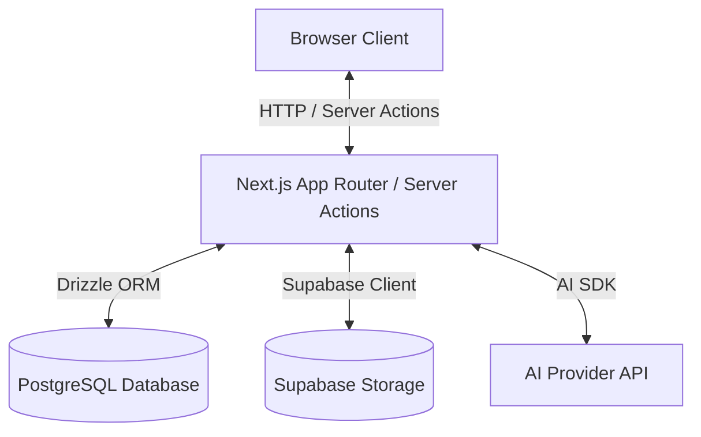

# ClauseWise — Production Audit

## 1. Confirmed Issues, Potential Risks, and Unknowns

### Confirmed Issues
- **Missing Landing Page**: The root route (`/`) currently redirects directly to `/dashboard`. There is no public landing page explaining features or linking to authentication.
- **Ollama Integration Pending**: The codebase currently relies on OpenAI APIs (`gpt-4o` and `text-embedding-3-small`) rather than the intended local Ollama models (`qwen3:4b` and `nomic-embed-text`).
- **Embedding Dimensions Mismatch**: The current database schema for `document_chunks.embedding` specifies `vector(1536)` for OpenAI, whereas `nomic-embed-text` produces 768 dimensions.

### Potential Risks
- **Data Migration for Embeddings**: Changing the vector dimensions from 1536 to 768 will require a database migration that will invalidate any existing document embeddings if there are documents currently stored.
- **AI Response Quality**: Transitioning from `gpt-4o` to a smaller 4B local model (`qwen3:4b`) may require substantial prompt tuning or extraction pipeline adjustments to maintain accuracy and structured JSON output capability.
- **OpenAI Remnants**: Fully removing OpenAI dependencies might break some `gpt-4o` specific structural output parsing code if the local Ollama provider does not support the same structured output options out of the box.

### Unknowns
- Are there existing users and documents in the production database that we need to preserve, and if so, how do we handle re-embedding existing documents?
- Is the production PostgreSQL instance properly configured with `pgvector` supporting 768 dimensions?
- Is Ollama properly hosted and accessible from the production environment?

## 2. Infrastructure Identification

- **Authentication Provider**: NextAuth.js v5 (Auth.js) using the Credentials provider with bcrypt hashing.
- **Identity Storage**: PostgreSQL database (tables: `user`, `account`, `session`, `verification_token`) managed via Drizzle ORM.
- **PostgreSQL Provider & Connection Method**: Configured via the `DATABASE_URL` environment variable. Likely Supabase PostgreSQL connected via connection pooling (Transaction Pooler or Direct URL as indicated by `.env.example`).
- **Document Metadata Storage**: PostgreSQL database (`documents`, `document_sections`, `document_chunks`, `document_findings` tables).
- **File Storage Provider**: Supabase Storage (`documents` private bucket).
- **Document Ownership Enforcement**: Application layer validation (strict `eq(documents.userId, cleanUserId)` filtering applied to Drizzle ORM queries).
- **AI Generation Provider**: OpenAI (`gpt-4o` using the official Node SDK).
- **Embedding Provider and Dimensions**: OpenAI (`text-embedding-3-small` with 1536 dimensions).
- **Production Deployment Platform**: Vercel (Next.js App Router, inferred from project configuration and `.env.example`).

## 3. Data Flow Diagram

## 4. Prioritized Implementation Plan

1. **Phase 1: Authentication and Data Ownership**
   - Verify the NextAuth credentials implementation works as expected.
   - Verify document ownership filtering in `getDocumentWorkspaceData` and `listUserDocuments` works end-to-end.
   - Add unauthorized access tests if missing.

2. **Phase 2: Landing Page**
   - Create a public landing page at `app/page.tsx` replacing the current redirect.
   - Implement responsive design, feature explanations, and sign-in entry points.
   - Preserve existing dashboard routes.

3. **Phase 3: Ollama Integration**
   - Update `drizzle.config.ts` and `lib/db/schema.ts` to change `document_chunks.embedding` from `vector(1536)` to `vector(768)`.
   - Apply Drizzle migrations (pending approval if destructive to production data).
   - Implement a new `lib/ai/ollama-client.ts` or refactor existing adapters to use Ollama for completions and embeddings.
   - Ensure credentials/URLs are safely configured via environment variables.

4. **Phase 4: Production Validation**
   - Run unit and E2E tests against the new setup.
   - Validate document upload, extraction, analysis, and retrieval flows.

## 5. Checks Requiring Production Access

- **PostgreSQL / pgvector**: Verify `pgvector` is installed and functioning on the production database. Check if there are existing embeddings that need to be recomputed.
- **Supabase Storage**: Verify the `documents` bucket exists, is set to private, and the service role key works.
- **Environment Variables**: Verify all necessary credentials (e.g., `NEXTAUTH_SECRET`, `SUPABASE_URL`, Ollama URL/API key if applicable) are correctly provisioned in Vercel.
