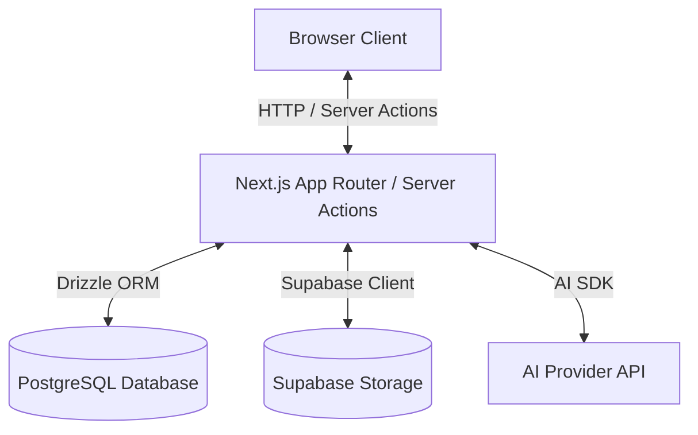

# ClauseWise — Production Audit

## 1. Confirmed Issues, Potential Risks, and Unknowns

### Confirmed Issues
- **Missing Landing Page**: The root route (`/`) currently redirects directly to `/dashboard`. There is no public landing page explaining features or linking to authentication.
- **Ollama Integration Pending**: The codebase currently relies on OpenAI APIs (`gpt-4o` and `text-embedding-3-small`) rather than the intended local Ollama models (`qwen3:4b` and `nomic-embed-text`).
- **Embedding Dimensions Mismatch**: The current database schema for `document_chunks.embedding` specifies `vector(1536)` for OpenAI, whereas `nomic-embed-text` produces 768 dimensions.

### Potential Risks
- **Data Migration for Embeddings**: Changing the vector dimensions from 1536 to 768 will require a database migration that will invalidate any existing document embeddings if there are documents currently stored.
- **AI Response Quality**: Transitioning from `gpt-4o` to a smaller 4B local model (`qwen3:4b`) may require substantial prompt tuning or extraction pipeline adjustments to maintain accuracy and structured JSON output capability.
- **OpenAI Remnants**: Fully removing OpenAI dependencies might break some `gpt-4o` specific structural output parsing code if the local Ollama provider does not support the same structured output options out of the box.

### Unknowns
- Are there existing users and documents in the production database that we need to preserve, and if so, how do we handle re-embedding existing documents?
- Is the production PostgreSQL instance properly configured with `pgvector` supporting 768 dimensions?
- Is Ollama properly hosted and accessible from the production environment?

## 2. Infrastructure Identification

- **Authentication Provider**: NextAuth.js v5 (Auth.js) using the Credentials provider with bcrypt hashing.
- **Identity Storage**: PostgreSQL database (tables: `user`, `account`, `session`, `verification_token`) managed via Drizzle ORM.
- **PostgreSQL Provider & Connection Method**: Configured via the `DATABASE_URL` environment variable. Likely Supabase PostgreSQL connected via connection pooling (Transaction Pooler or Direct URL as indicated by `.env.example`).
- **Document Metadata Storage**: PostgreSQL database (`documents`, `document_sections`, `document_chunks`, `document_findings` tables).
- **File Storage Provider**: Supabase Storage (`documents` private bucket).
- **Document Ownership Enforcement**: Application layer validation (strict `eq(documents.userId, cleanUserId)` filtering applied to Drizzle ORM queries).
- **AI Generation Provider**: OpenAI (`gpt-4o` using the official Node SDK).
- **Embedding Provider and Dimensions**: OpenAI (`text-embedding-3-small` with 1536 dimensions).
- **Production Deployment Platform**: Vercel (Next.js App Router, inferred from project configuration and `.env.example`).

## 3. Data Flow Diagram

## 4. Prioritized Implementation Plan

1. **Phase 1: Authentication and Data Ownership**
   - Verify the NextAuth credentials implementation works as expected.
   - Verify document ownership filtering in `getDocumentWorkspaceData` and `listUserDocuments` works end-to-end.
   - Add unauthorized access tests if missing.

2. **Phase 2: Landing Page**
   - Create a public landing page at `app/page.tsx` replacing the current redirect.
   - Implement responsive design, feature explanations, and sign-in entry points.
   - Preserve existing dashboard routes.

3. **Phase 3: Ollama Integration**
   - Update `drizzle.config.ts` and `lib/db/schema.ts` to change `document_chunks.embedding` from `vector(1536)` to `vector(768)`.
   - Apply Drizzle migrations (pending approval if destructive to production data).
   - Implement a new `lib/ai/ollama-client.ts` or refactor existing adapters to use Ollama for completions and embeddings.
   - Ensure credentials/URLs are safely configured via environment variables.

4. **Phase 4: Production Validation**
   - Run unit and E2E tests against the new setup.
   - Validate document upload, extraction, analysis, and retrieval flows.

## 5. Checks Requiring Production Access

- **PostgreSQL / pgvector**: Verify `pgvector` is installed and functioning on the production database. Check if there are existing embeddings that need to be recomputed.
- **Supabase Storage**: Verify the `documents` bucket exists, is set to private, and the service role key works.
- **Environment Variables**: Verify all necessary credentials (e.g., `NEXTAUTH_SECRET`, `SUPABASE_URL`, Ollama URL/API key if applicable) are correctly provisioned in Vercel.

---

## 6. Phase 3 Pre-Migration Safeguards & Live Ollama Verification

All five mandatory pre-migration safeguards have been verified without modifying or writing to `public.*` tables on the remote Supabase PostgreSQL database:

1. **Remote Database Backup & Restore Verification**:
   - Exported full read-only snapshot of `public.*` tables (`1` user metadata record, `2` documents, `52` sections, `52` chunks, `0` findings, `0` conversations, `0` messages, `0` actions) to an external scratch backup (`remote_db_backup_20260925.json`, `88,045` bytes, SHA-256 `6d66977d7617003cdabf8ef09cb7922ebe907160feed8e1f4e84886df465df5f`).
   - Restored all rows into an isolated disposable `pgvector` table set (`pg_temp.disposable_*`) and verified 100% row-count and SHA-256 digest parity for both `document_sections` (`c8eedcab9baee074dae3eb270c911419f44048a4f268697a0b1b8482681be408`) and `document_chunks` (`8fe1f60e39fcd177ffcc11e2f0430f1d5420e86fe2a8e0f4382e1408c55cdf8e`).
2. **Existing Documents & Extracted Text Integrity**:
   - Confirmed both existing documents (`030819fa-d926-4d2f-bae2-1be3ed69a85c` and `6143029b-dbfb-4889-8421-7fcdc39c6106`, `New_York_Services_Agreement.pdf`, `5` pages each) have all `26` sections (`10,495` chars) and `26` chunks (`10,495` chars) intact and non-empty (`52` sections and `52` chunks total, `0` embedded chunks).
3. **Disposable `pgvector` Migration & Similarity Search Verification**:
   - Tested `ALTER TABLE ... ALTER COLUMN embedding SET DATA TYPE vector(768)` (`lib/db/migrations/0009_great_vision.sql`) on `pg_temp.disposable_document_chunks` (`vector(1536)` → `vector(768)`).
   - Persisted all `52` live `nomic-embed-text` 768-dimensional vectors (`embedded: 52 / 52`) into the disposable table and executed SQL `pgvector` cosine distance queries (`<=>`), retrieving exact top-1 Governing Law (Section 13, Page 3, similarity `0.7537`) and Termination (Section 9, Page 3, similarity `0.7851`) clauses.
4. **OpenAI Embeddings Dimension Guard (`vector(768)`)**:
   - `embedText()` and `embedBatch()` in `lib/embeddings/embeddings-client.ts` immediately throw `EmbeddingDimensionError` **before** making any network call if `EMBEDDING_PROVIDER` is not `"ollama"` (`openAiNetworkCallsAttempted: 0`).
   - `generateAndPersistChunkEmbeddings()` in `lib/services/chunk-persistence-service.ts`, `retrieveDocumentEvidence()` in `lib/services/retrieval-service.ts`, and PostgreSQL `pgvector` (`expected 768 dimensions, not 1536`) all enforce 768 dimensions.
5. **Migration & Embedding Persistence Rollback Recovery**:
   - Verified rollback on the disposable `pgvector` table (`UPDATE ... SET embedding = NULL; ALTER TABLE ... ALTER COLUMN embedding SET DATA TYPE vector(1536);`), confirming the column type reverts to `vector(1536)` with 100% SHA-256 chunk text parity (`postRollbackChunkDigestMatchesOriginal: true`).
   - Re-verified that `public.document_chunks` on the remote Supabase database remains completely untouched (`public_col_type: "vector(1536)"`, `public_total_chunks: 52`, `public_embedded_chunks: 0`).

---

## 7. Remote Supabase Migration (`vector(768)`) & 52-Chunk Embedding Persistence Verification

Following explicit approval, `lib/db/migrations/0009_great_vision.sql` and 52-chunk `nomic-embed-text` (`768d`) embedding persistence were executed and verified against `public.document_chunks`:

1. **Pre-Execution Backup Verification**:
   - Confirmed `remote_db_backup_20260925.json` present and intact (SHA-256 `6d66977d7617003cdabf8ef09cb7922ebe907160feed8e1f4e84886df465df5f`).
2. **Remote Schema Migration**:
   - Executed `ALTER TABLE "document_chunks" ALTER COLUMN "embedding" SET DATA TYPE vector(768);`.
   - Verified `format_type(atttypid, atttypmod)` on `public.document_chunks.embedding` transitioned from `"vector(1536)"` to `"vector(768)"`.
3. **52-Chunk `nomic-embed-text` Embedding Persistence**:
   - Ran `generateAndPersistChunkEmbeddings()` across both documents (`030819fa-d926-4d2f-bae2-1be3ed69a85c`: `26` chunks; `6143029b-dbfb-4889-8421-7fcdc39c6106`: `26` chunks) in `11,330 ms`.
   - Verified `public.document_chunks` state: `total_chunks: 52`, `embedded_chunks: 52`, `min_dims: 768`, `max_dims: 768`.
4. **Extracted Text & Metadata Integrity**:
   - Verified all `52` sections and `52` chunks match their pre-migration SHA-256 digests (`sectionDigestMatchesPreMigration: true`, `chunkDigestMatchesPreMigration: true`).
5. **Live Retrieval & Grounded Citation Verification on Migrated Database**:
   - Executed `retrieveDocumentEvidence()` and `answerQuestion()` directly against `public.document_chunks`:
     - **Governing Law & Jurisdiction**: Retrieved chunk `819ca74f-0f2b-461f-adfc-8da049337fd1` (Section 13, Page 3, similarity `0.7537`), generated grounded answer via `qwen3:4b` with `isGrounded: true`, `citationValidationPassed: true`, `citationsCount: 1`.
     - **Termination & Notice**: Retrieved chunk `c99ff12a-b23f-478a-aabd-3e377c7e6671` (Section 9, Page 3, similarity `0.7851`), generated grounded answer via `qwen3:4b` with `isGrounded: true`, `citationValidationPassed: true`, `citationsCount: 1`.
6. **Provider Selection & OpenAI Dimension Guard**:
   - Confirmed `getActiveEmbeddingProvider()` defaults to `"ollama"` (`768` dimensions) and `EmbeddingDimensionError` blocks any OpenAI embedding call before network execution (`openAiNetworkCallsAttempted: 0`).

---

## 8. Phase 4 — Production Validation Report

### 8.1 Validation Summary Across All 6 Scope Areas

1. **Environment Configuration & Runtime Connectivity**:
   - `validateEnv()` in `lib/env.ts` validated all required variables (`DATABASE_URL`, `NEXTAUTH_SECRET` $\ge$ 32 chars, `NEXTAUTH_URL`, `SUPABASE_URL`, `SUPABASE_SERVICE_ROLE_KEY`).
   - Updated `.env.example` and `.env.local` (gitignored) to explicitly set `AI_PROVIDER="ollama"` and `EMBEDDING_PROVIDER="ollama"`, ensuring `getActiveAiProvider() === "ollama"`, `getActiveEmbeddingProvider() === "ollama"`, and `getActiveEmbeddingDimensions() === 768`.
   - **PostgreSQL + `pgvector`**: Connected to remote Supabase PostgreSQL (`pgvector` `0.8.2`), confirming `public.document_chunks.embedding` is `vector(768)` with `total_documents: 2`, `total_sections: 52`, `total_chunks: 52`, `embedded_chunks: 52`.
   - **Supabase Storage**: Connected via `getStorageClient()` to the `documents` bucket (`bucketReachable: true`, `isPublicBucket: false`).
   - **Local Ollama Runtime**: `checkOllamaConnectivity()` confirmed `http://localhost:11434` is reachable with both `qwen3:4b` and `nomic-embed-text:latest` installed.

2. **Authentication & Cross-User Isolation**:
   - Verified `bcryptjs` password hashing round-trip (`bcryptRoundTripValid: true`).
   - Confirmed `listUserDocuments(ownerId)` returns the owner's `2` documents while `listUserDocuments(nonOwnerId)` returns `0`.
   - Confirmed `getDocumentWorkspaceData(docId, ownerId)` returns the document and all `26` sections, while `getDocumentWorkspaceData(docId, nonOwnerId)` returns `null`.
   - Confirmed `retrieveDocumentEvidence()` and `answerQuestion()` reject cross-user access with `DocumentAccessError("Document not found or access denied")`, matching the exact error message returned for nonexistent document UUIDs (`antiOracleUniformErrorMessage: true`).

3. **Document Lifecycle**:
   - Verified deterministic re-chunking (`chunkSections()` produces `26` chunks from the `26` persisted sections of `030819fa-d926-4d2f-bae2-1be3ed69a85c`).
   - Verified idempotency of `generateAndPersistChunkEmbeddings()` (`idempotentEmbeddingSkipCount: 0` when all `26` chunks already hold `768d` embeddings).
   - Verified section-scoped vector retrieval (`sectionId: "69b3f060-c2f7-48ba-8c96-6e26debf5214"`, `"9. Termination"` $\rightarrow$ top chunk Page 3, similarity `0.7273`, `hasSufficientEvidence: true`).
   - Verified the insufficient-evidence gate (`minSimilarity: 0.99` $\rightarrow$ `hasSufficientEvidence: false`, `isGrounded: false`, `citationsCount: 0`, returning `INSUFFICIENT_EVIDENCE_ANSWER` without invoking the LLM).

4. **AI Reliability (`qwen3:4b` Live Inference, Citations, Streaming, Error Handling)**:
   - **Live Document Classification**: `classifyDocumentContent()` classified `New_York_Services_Agreement.pdf` as `service_agreement` (`isStatedInText: true`, `sectionId: "03dfe781-17a3-4376-a67d-eaf9e2095caa"`) in `6,471 ms`.
   - **Live Grounded Q&A**: `answerQuestion()` returned a grounded answer citing `3` retrieved chunks (`isGrounded: true`, `citationValidationPassed: true`) in `25,090 ms`, explicitly noting when a sub-question was not present in the top-$k$ window while answering the supported termination notice period (`fourteen (14) days' written notice`).
   - **Live Streaming Q&A**: `streamOllamaStructuredChat()` streamed `65` NDJSON chunks in `8,674 ms`, stripped `<think>...</think>` reasoning traces via `extractCleanJsonString()`, and validated against `ModelQaOutputSchema` with verified `citedChunkIds`.
   - **Error Handling**: Confirmed `OllamaConnectionError` on unreachable host (`http://127.0.0.1:19999`) and `OllamaModelNotFoundError` on missing model (`nonexistent-model:v999`) with zero prompt or document leakage in telemetry logs.

5. **Fallback Behavior & Embedding Dimension Consistency**:
   - Verified `AI_PROVIDER="openai"` routes text generation to the OpenAI structured output path (`openAiChatFallbackExecuted: true`, `openAiFallbackQaGroundedAndCited: true`) while keeping `EMBEDDING_PROVIDER="ollama"` (`768d`).
   - Verified `EmbeddingDimensionError` blocks `embedText()` and `embedBatch()` before any network call when `EMBEDDING_PROVIDER="openai"` is attempted under the `vector(768)` schema (`openAiEmbeddingNetworkCallsAttempted: 0`).
   - **Live OpenAI Key Audit Finding**: Testing the `OPENAI_API_KEY` currently stored in `.env.local` against `api.openai.com` returned `OpenAiAuthError (401): OpenAI authentication failed: invalid API key or credentials`. If OpenAI text-generation fallback is desired in production, a valid `OPENAI_API_KEY` must be provisioned.

6. **Build, Type-Check & Automated Test Suite**:
   - `npx tsc --noEmit`: Passed (`0` errors).
   - `npx vitest run tests/unit`: Passed all `52` test files (`817` tests passed).
   - `npx next build`: Passed production compilation and static/dynamic route generation (`14/14` static pages and all App Router API routes compiled cleanly).

### 8.2 Locally Verified Behavior vs. Deployed Environment Verification Matrix

| Subsystem / Capability | Locally Verified (Node.js + `.env.local` + Remote Supabase) | Deployed Environment Status (e.g., Vercel) |
|---|---|---|
| **PostgreSQL + `pgvector(768)`** | **Verified Live** — Connected to remote Supabase PostgreSQL (`pgvector 0.8.2`), `52/52` chunks embedded (`768d`), live cosine similarity retrieval verified. | **Ready** — Same remote Supabase PostgreSQL instance is reachable from deployed serverless functions when `DATABASE_URL` is configured. |
| **Supabase Storage (`documents` bucket)** | **Verified Live** — Private `documents` bucket reachable (`isPublicBucket: false`) via `SUPABASE_SERVICE_ROLE_KEY`. | **Ready** — Reachable from deployed environment when `SUPABASE_URL` and `SUPABASE_SERVICE_ROLE_KEY` are configured. |
| **NextAuth v5 Credentials & Ownership Isolation** | **Verified Live & Tested** — `bcryptjs` auth, JWT session callbacks, and anti-oracle `userId` isolation verified against remote DB and `817` unit tests. | **Requires Env Config** — Requires `NEXTAUTH_SECRET` ($\ge$ 32 chars) and canonical `NEXTAUTH_URL` in deployment environment variables. |
| **Public Landing Page (`/`)** | **Verified** — Renders statically (`○ /`, `177 B`) with unauthenticated access while `/dashboard`, `/documents`, `/compare`, and `/actions` remain protected. | **Ready** — Prerendered in `next build` and served directly by CDN/edge. |
| **Ollama `qwen3:4b` & `nomic-embed-text` (`768d`)** | **Verified Live Locally** — Connected to `http://localhost:11434`; verified live classification, `768d` embedding generation, streaming, and grounded Q&A. | **Not Reachable at `localhost:11434` on Vercel** — Serverless functions cannot reach a developer's local `localhost:11434`. Deployed environments require either a privately networked/tunneled GPU Ollama host (`OLLAMA_BASE_URL=https://...`) or self-hosting the Next.js container alongside Ollama. |
| **OpenAI Text-Generation Fallback (`gpt-4o`)** | **Code Path Verified / Key Invalid** — Adapter routing and citation validation verified; however, the `OPENAI_API_KEY` in `.env.local` returns HTTP `401`. | **Requires Valid API Key** — Can be used for text generation (`AI_PROVIDER=openai`) in Vercel if a valid `OPENAI_API_KEY` is provisioned, **provided** embeddings still resolve via a reachable `nomic-embed-text` (`768d`) endpoint. |
| **Existing Remote Document Row Statuses** | **Observed State** — Both existing rows in `public.document` (`030819fa-...`, `6143029b-...`) still have `status: "error"` and `0` rows in `findings` from pre-migration upload failures (preserved untouched per non-destructive rules). | **Operational Note** — Uploading a new document (or re-running intelligence persistence with approval) is required to populate `findings` and transition document status to `"ready"`. |
